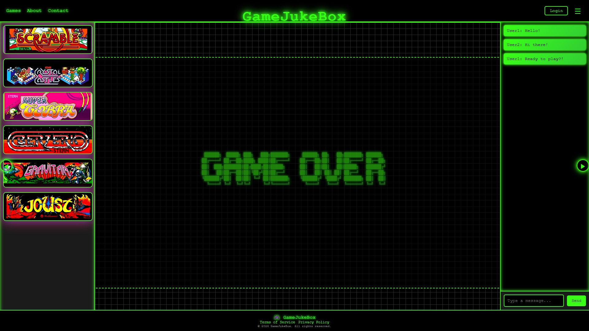

# Game Juke Box (GJB)

## **프로젝트 소개**

**Game Juke Box**는 다양한 미니게임들을 쉽고 빠르게 즐길 수 있는 게임 플랫폼을 목표로 개발 중인 프로젝트이다.

- 사용자별 점수 기록 및 랭킹 시스템 구현.
- 업적, 통계 등 사용자 맞춤형 기능 제공.

------

## **현재 진행 상황**

### **1. 프로젝트 초기 설정**

- Spring Boot 기반의 백엔드와 정적 파일(HTML, CSS, JavaScript) 기반의 프론트엔드 통합 방식으로 진행.
- Spring Initializer를 통해 기본 프로젝트 생성 및 종속성 설정:
  - `Spring Boot Starter Web`, `Spring Boot Starter Security`, `Spring Boot Starter Data JPA` 등.

### **2. 데이터베이스 연동**

- MySQL 설치 및 설정
  - 데이터베이스 이름: `rmarn_gjb`
  - 사용자 계정: `rmarn`@`localhost`
  - 비밀번호: `1234`
- MySQL과 Spring Boot의 연동 성공.

### **3. 보안 및 권한 관리**

- Spring Security 기본 설정 커스터마이징:
  - 모든 요청 허용(임시 개발용 설정).
  - CSRF 비활성화.
  - 추후 회원가입 및 로그인 구현 예정.

------

## **앞으로의 계획**

### **1. 핵심 기능 개발**

1. **회원가입 및 로그인**
   - 사용자 인증/인가 로직 개발.
   - 비밀번호 암호화 및 보안 처리.
2. **게임 관리**
   - 게임 목록 및 실행 기능 구현.
   - 사용자의 점수 기록 및 랭킹 시스템 개발.
3. **프로필 페이지**
   - 사용자 개인 정보 및 업적 관리.
   - 비밀번호 변경 기능 제공.

### **2. 코드 관리**

- GitHub 브랜치를 활용하여 FE/BE 분리하여 작업 진행.

------

## **개발 환경 및 기본 설정**

### **1. 개발 도구**

- **Java**: JDK 17 이상.
- **데이터베이스**: MySQL 8.0.
- **빌드 도구**: Maven.

### **2. 프로젝트 구조**

```bash
GJB/
├── src/
│   ├── main/
│   │   ├── java/com/example/gjb/
│   │   │   ├── config/      # Spring Security 및 설정 관련 클래스
│   │   │   ├── controllers/ # API 컨트롤러 클래스
│   │   │   ├── models/      # JPA 엔티티 클래스
│   │   │   ├── repositories/ # 데이터베이스 접근 레이어
│   │   │   ├── services/    # 비즈니스 로직
│   │   ├── resources/
│   │       ├── static/      # 정적 파일 (HTML, CSS, JS)
│   │       ├── application.properties # 애플리케이션 설정 파일
│   └── test/
├── pom.xml                   # Maven 설정 파일
└── README.md                 # 프로젝트 설명 파일
```

### **3. 데이터베이스 설정**

`application.properties` 파일에 다음과 같이 설정:

```properties
spring.datasource.url=jdbc:mysql://localhost:3306/rmarn_gjb
spring.datasource.username=rmarn
spring.datasource.password=1234
spring.jpa.hibernate.ddl-auto=update
```
------
## **스크린샷**

### 메인 화면



------

